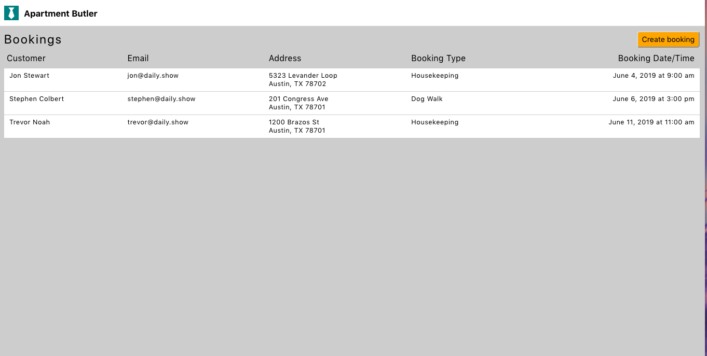

# Apartment Butler

## Description

A booking app which allows users to create a booking appointment and displays all current appointments from a database. Built with React, Node, and MySQL.

🚀 Deployed at: https://aptbutler.herokuapp.com

## Getting Started

These instructions will get you a copy of the project up and running on your local machine for development and testing purposes.

### Installation

Please clone and download this folder to your hard disk. You will then navigate to the folder and run `npm install` or `yarn`. This will install the required dependencies.

Update the `PORT` settings in `server.js` if necessary, and type `npm start` to get your development server running. Open your favorite browser and visit `localhost:xxxx` in your browser where `xxxx` will be your port number for front-end and back-end. The defaults are `3000` and `3001`.

### Data Persistence

Ensure that you have a MySQL database server running locally for data persistence and configure the details in `config/config.json`.

## Technologies Used

- React
- CSS Flexbox
- Node.js
- MySQL
- Sequelize

## Authors

- Harpal Assi
